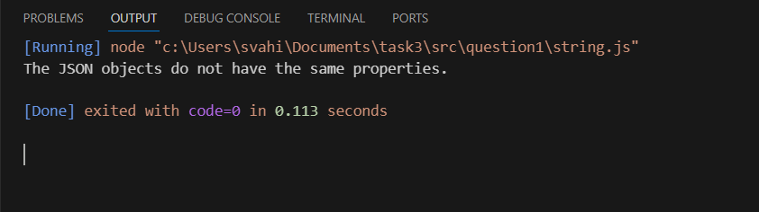
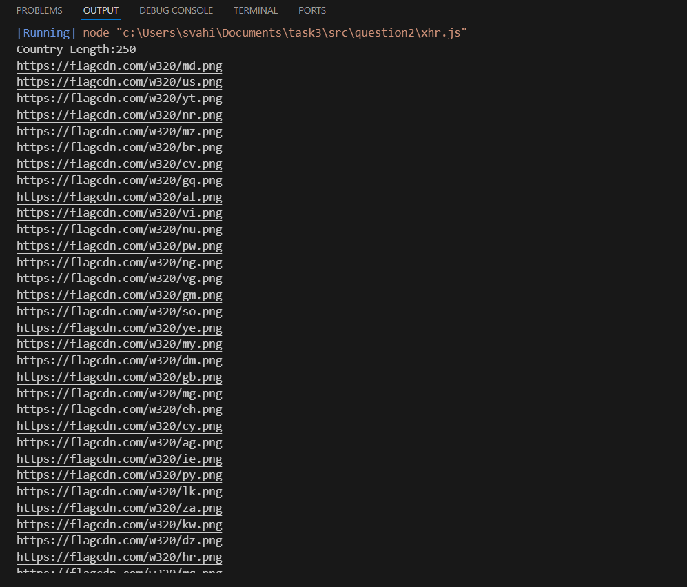
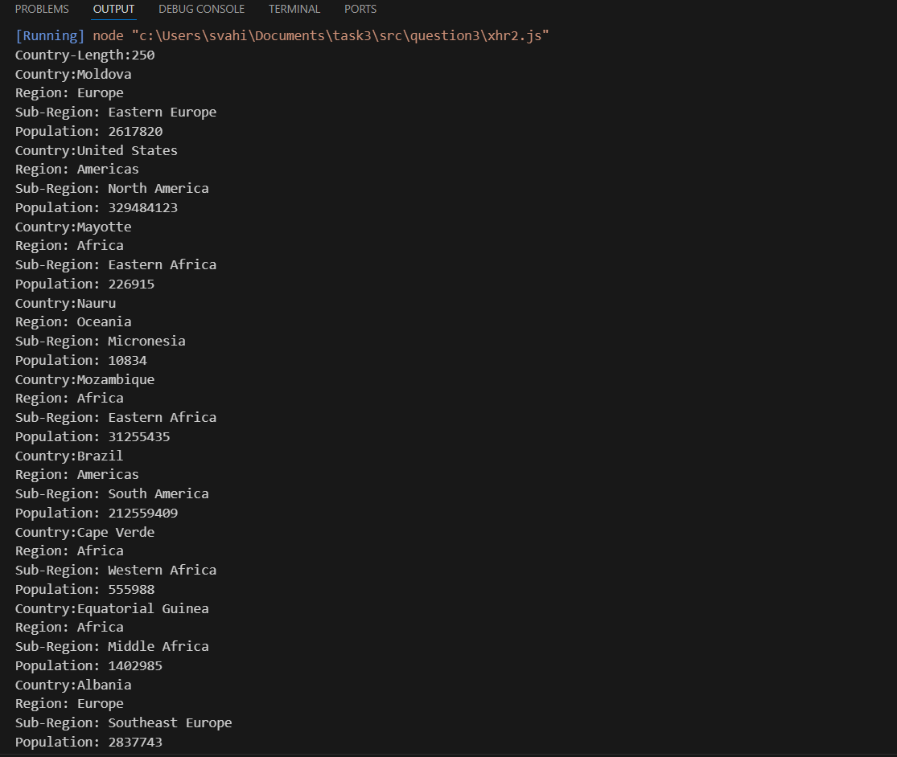

This repository shows the output screenshots for the task.
 

## Sub-Task 1

1.how to compare two JSON have the same properties without order?
     
     a. let obj1 = {name: "Person 1", age: 5};
     b. let obj2 = {age: 5, name: "Person 1"};

## Output Screenshots

## Sub-Task 2

#### Description
   In my System image icon is not supported so here I display all country flags `png` URL

2. Use the rest countries' API URL-> https://restcountries.com/v3.1/all and display all the  country flags in the console.

## Sub-Task 3

3.USe the same rest countries API URL-> https://restcountries.com/v3.1/all and print all countries names,regions,sub region and populations

